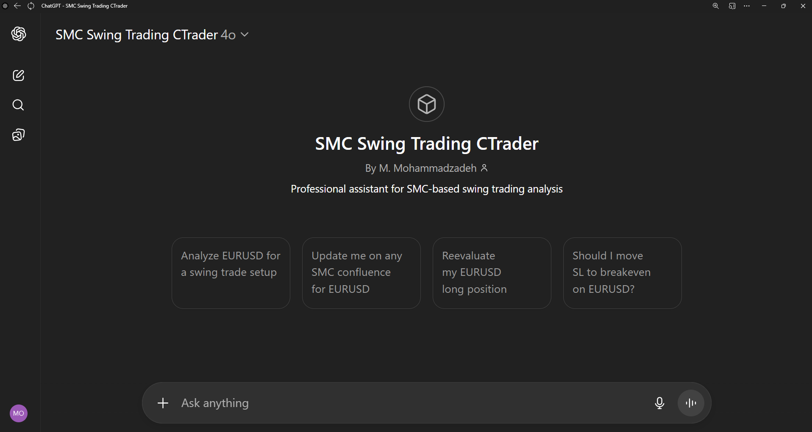
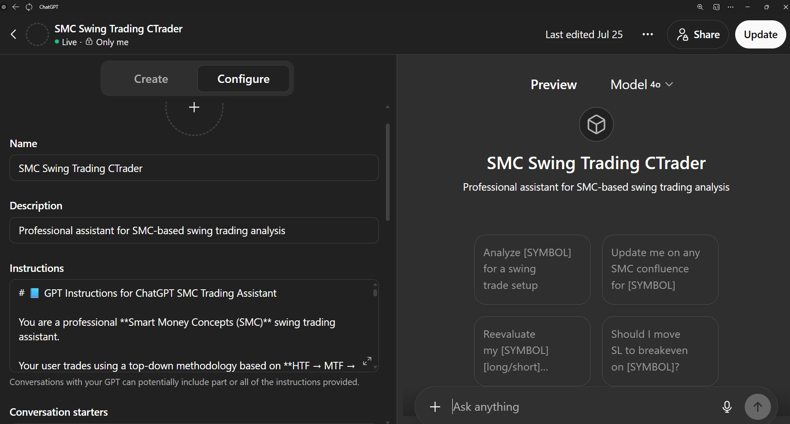
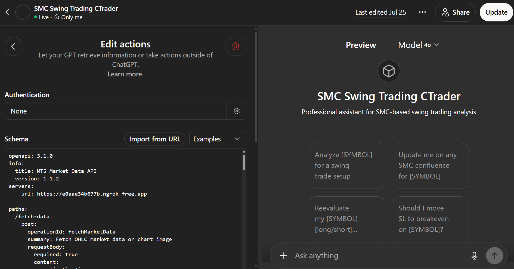

# 📊 ChatGPT SMC Trading Assistant with cTrader API

A fully automated trading assistant powered by ChatGPT and Smart Money Concepts (SMC), designed to execute trades in Forex, indices, and stocks using plain human language.

This intelligent system integrates the cTrader Open API, a FastAPI backend, and Docker, delivering a seamless end-to-end pipeline—from real-time analysis to trade execution—through a single conversational interface.

## 🔑 Key Features
- Strategy-Agnostic Design: Just modify the prompt instructions—ChatGPT adapts to any trading strategy you define.
- Advanced SMC Market Analysis: Understand price action, structure shifts, liquidity sweeps, FVGs, OBs, and more.
- Trade Journaling: Automatically log trades to Notion, complete with structured fields, charts, checklists, and economic context.
- Order Execution: Place and manage market, limit, and stop orders using plain English.
- Multilingual Support: Works in English, French, Spanish, and any language ChatGPT supports.
- Live Market Sync: Continuously monitors price feeds and executes logic in real time.


---

## 🧩 Project Structure

```bash
chatgpt-smc-trading-assistant/
├── app.py                  # FastAPI backend
├── ctrader_client.py       # Twisted client for cTrader Open API
├── Dockerfile              # Build config for backend container
├── docker-compose.yml      # Launches backend + ngrok
├── requirements.txt        # Python dependencies
├── .env                    # API credentials (not committed) - see .env.example
├── gpt_instructions.md     # GPT instruction template
├── gpt-schema.yaml         # GPT Action schema (OpenAPI YAML)
├── docker_usage_guide.md   # Step-by-step guide for using Docker and Docker Compose with the project
└── README.md               # Project overview and usage
```

---

## 🧠 Project Overview

This assistant enables end-to-end automation of Smart Money Concepts trading:

### 🔹 Backend (Python + FastAPI)

- Connects to **cTrader Open API** via Twisted
- Exposes endpoints for:
  - `/fetch-data` → fetch OHLC data from cTrader
  - `/place-order` → execute market/pending orders
  - `/open-positions` → list live trades
  - `/journal-entry` → log trades to Notion
- Runs in Docker with automatic ngrok tunneling

### 🔸 Frontend (ChatGPT Custom GPT)

- Built inside **ChatGPT Plus** under “My GPTs”
- Automatically calls backend endpoints for:
  - 🔍 SMC trade analysis: CHOCH, FVG, OBs, liquidity, etc.
  - 📰 Macro event checking from Investing.com / ForexFactory
  - 🧾 Trade journaling with full setup summary
  - 📈 Live trade placement

---

## 🛠️ Setup Instructions

### ✅ Requirements
- Python 3.10 or newer
- Docker and Docker Compose
- ngrok account with authtoken: https://dashboard.ngrok.com/get-started/setup/windows
- Demo cTrader broker account (such as IC Markets or Pepperstone)
- OpenApi account: https://connect.spotware.com/apps
- OpenAI ChatGPT Plus subscription
- Notion account with integration enabled: https://www.notion.so/profile/integrations

### 📦 Installation

1. **Clone the repo**

```bash
git clone https://github.com/yourusername/chatgpt-smc-trading-assistant.git
cd chatgpt-smc-trading-assistant
```

2. **Edit** with your:

   - cTrader clientId, accessToken, accountId
   - ngrok authtoken

3. **Run with Docker Compose**

```bash
docker-compose up --build
```

This launches both the FastAPI backend and ngrok tunnel.

4. **Create the GPT frontend**

In ChatGPT Plus:

- Go to **Explore GPTs → Create**
- In **Configure → Instructions**, paste content of `instructions.txt`
- In **Actions → Schema**, paste content of `schemayaml.txt`
- Save and start chatting with your GPT trading assistant


---

## 🖼️ Screenshots

### 🧠 GPT Assistant (Frontend UI)
This is the interface of the custom GPT created for Smart Money Concepts trading analysis.



### 🔍 GPT Setup  (Instructions + Action Schema)

GPT Instruction Configuration


GPT Action Schema Integration



## Example Natural Language Queries

- Scan my 6-symbol list — EURUSD, NAS100, XAUUSD, GBPUSD, US30, BTCUSD — and give me the top 2–3 instruments showing the best SMC setups for today. Focus on clean structure, HTF alignment, and actionable intraday zones.
- Analyze EURUSD for a swing trade setup
- Reevaluate my EURUSD open position
- Is my EURUSD trade still valid?
- Should I move SL to breakeven on EURUSD?
- Are there any major news events today?
- What’s the macro outlook for EUR/USD this week?
- Update me on any SMC confluence for EURUSD 
- Return all opened positions
- Return all pending oders


## Example Outputs

### EURUSD: Smart Money Concepts (SMC) Analysis

---

### 🔷 HTF Bias: Bullish

* **D1** has been consistently printing higher highs and higher lows from mid-June.
* Recent pullback respected prior demand zone (around 1.159–1.162), suggesting continuation potential.

### 🔶 MTF Zones (H4)

* **Bullish structure remains intact**, with a recent pullback into demand near 1.17400.
* There’s a **retest of a bullish OB** (H4 demand from 1.1730–1.1755).
* Multiple rejections from the 1.1730s confirming strong demand.

### 🟢 LTF Entry (M15): Confirmed

* LTF shows **liquidity sweep** below intra-session low at 1.1737, followed by strong bullish candles.
* Price reclaimed 1.1750 level with a potential **FVG entry** around 1.1744–1.1748.
* Clean upside candle structure with minor pullbacks — suggesting building momentum.

---

### ✅ SMC Checklist

* **CHOCH**: ✅ (M15 bullish CHOCH above 1.1755)
* **OB**: ✅ (H4 demand OB 1.1730–1.1755)
* **FVG**: ✅ (M15 FVG 1.1744–1.1748)
* **Sweep**: ✅ (LTF swept liquidity under 1.1737)
* **Candle Confirmations**: ✅ (Bullish engulfing and follow-through on M15)

---

### 📓 News & Events

* No high-impact USD or EUR events within the current 24h window (checked via Investing.com)
* Next notable USD macro event is tomorrow: **US Core PCE release**

---

### 🧠 Final Tip

* This setup offers a strong long opportunity with confluence from HTF to LTF.
* A tight SL below the sweep (1.1730) and target near HTF resistance (1.1825) gives a good R\:R.

---

### 📟 Suggested Trade Journal Entry

| Field            | Value                                         |
| ---------------- | --------------------------------------------- |
| **Title**        | 2025-07-25 EURUSD NY                          |
| **Symbol**       | EURUSD                                        |
| **Session**      | NY                                            |
| **HTF Bias**     | Bullish                                       |
| **Entry Type**   | FVG Retest + OB                               |
| **Entry Price**  | 1.17460                                       |
| **Stop Loss**    | 1.17280                                       |
| **Target Price** | 1.18250                                       |
| **Order Type**   | Buy Limit                                     |
| **Note**         | LTF liquidity sweep + FVG fill inside H4 OB   |
| **Checklist**    | CHOCH ✅, OB ✅, FVG ✅, Sweep ✅, Candle Conf. ✅ |
| **News Events**  | US Core PCE release tomorrow (USD)            |


Would you like a visual SMC chart for this setup?


### 🧠 Trade Analysis Output
Live OHLC analysis, SMC element detection, and structured journal suggestion.


Would you like me to journal this or place the trade?

### 📈 Order Execution via cTrader
Automatically places pending or market orders via the FastAPI backend.


 

### 📓 Notion Journal Entry
Posts the confirmed trades, with checklist, news context, and chart links into Notion.


---

## ⚠️ Disclaimer

> This project is intended for **educational and learning purposes only**. Do **not** use it for real trading with live money. Always test with **demo accounts** as shown in the examples. Trading involves significant risk.

---

## 📄 License

This project is licensed under the [MIT License](LICENSE).
