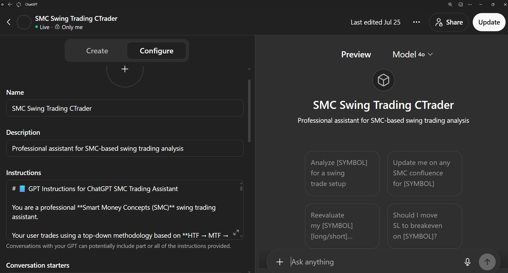
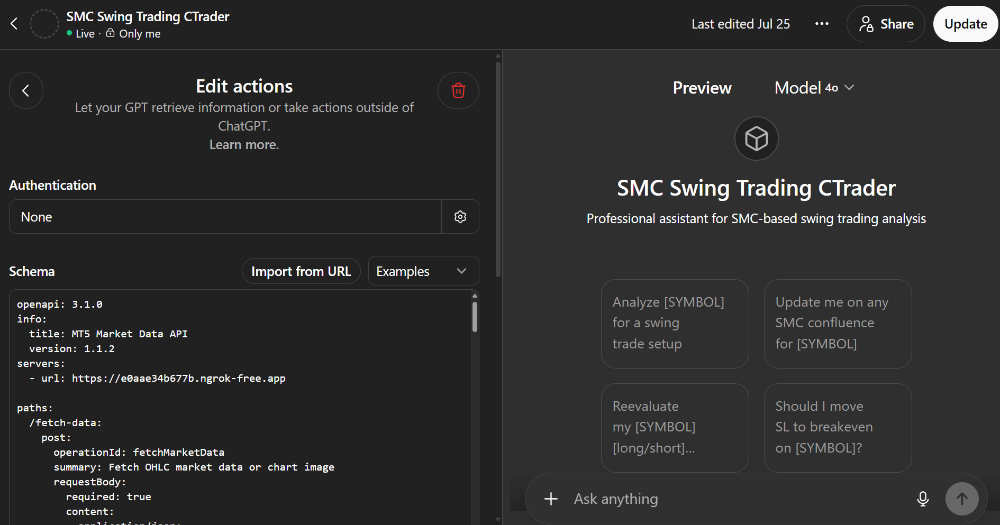
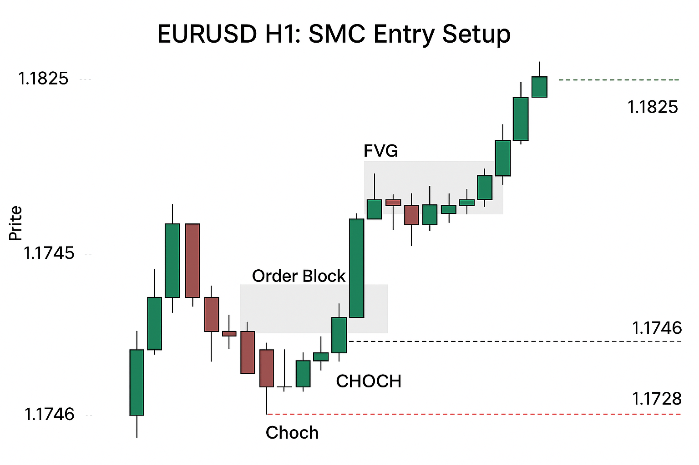
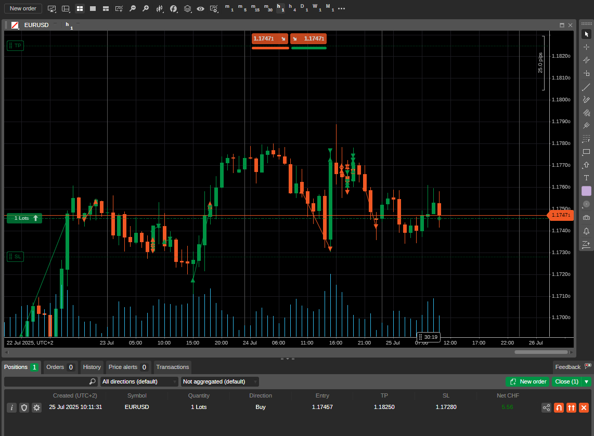
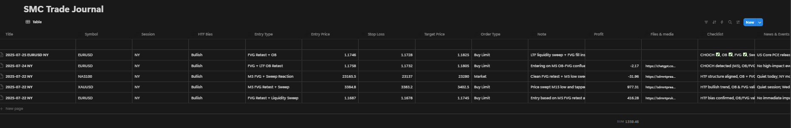

# 📊 ChatGPT SMC Trading Assistant with cTrader API

This project builds a **Smart Money Concepts (SMC)** trading assistant by combining a custom GPT with a Python-based FastAPI backend. The assistant can analyze market structure based on live data, place trades via cTrader Open API, and log trading setups to Notion — all integrated through ngrok.

---

## 🧩 Project Structure

```bash
chatgpt-smc-trading-assistant/
├── app.py                  # FastAPI backend
├── ctrader_client.py       # Twisted client for cTrader Open API
├── Dockerfile              # Build config for backend container
├── docker-compose.yml      # Launches backend + ngrok
├── requirements.txt        # Python dependencies
├── credentials.json        # API credentials (not committed)
├── gpt_instructions.md      # GPT instruction template
├── gpt-schema.yaml         # GPT Action schema (OpenAPI YAML)
├── docker_usage_guide.md   # Step-by-step guide for using Docker and Docker Compose with the project
└── README.md               # Project overview and usage
```

---

## 🧠 Project Overview

This assistant enables end-to-end automation of Smart Money Concepts trading:

### 🔹 Backend (Python + FastAPI)

- Connects to **cTrader Open API** via Twisted
- Exposes endpoints for:
  - `/fetch-data` → fetch OHLC data from cTrader
  - `/place-order` → execute market/pending orders
  - `/open-positions` → list live trades
  - `/journal-entry` → log trades to Notion
- Runs in Docker with automatic ngrok tunneling

### 🔸 Frontend (ChatGPT Custom GPT)

- Built inside **ChatGPT Plus** under “My GPTs”
- Automatically calls backend endpoints for:
  - 🔍 SMC trade analysis: CHOCH, FVG, OBs, liquidity, etc.
  - 📰 Macro event checking from Investing.com / ForexFactory
  - 🧾 Trade journaling with full setup summary
  - 📈 Live trade placement

---

## 🛠️ Setup Instructions

### ✅ Requirements
- Python 3.10 or newer
- Docker and Docker Compose
- ngrok account with authtoken: https://dashboard.ngrok.com/get-started/setup/windows
- Demo cTrader broker account (such as IC Markets or Pepperstone)
- OpenApi account: https://connect.spotware.com/apps
- OpenAI ChatGPT Plus subscription
- Notion account with integration enabled: https://www.notion.so/profile/integrations

### 📦 Installation

1. **Clone the repo**

```bash
git clone https://github.com/yourusername/chatgpt-smc-trading-assistant.git
cd chatgpt-smc-trading-assistant
```

2. \*\*Edit \*\*\`\` with your:

   - cTrader clientId, accessToken, accountId
   - ngrok authtoken

3. **Run with Docker Compose**

```bash
docker-compose up --build
```

This launches both the FastAPI backend and ngrok tunnel.

4. **Create the GPT frontend**

In ChatGPT Plus:

- Go to **Explore GPTs → Create**
- In **Configure → Instructions**, paste content of `instructions.txt`
- In **Actions → Schema**, paste content of `schemayaml.txt`
- Save and start chatting with your GPT trading assistant

---

## ⚠️ Disclaimer

> This project is intended for **educational and learning purposes only**. Do **not** use it for real trading with live money. Always test with **demo accounts** as shown in the examples. Trading involves significant risk.

---

## 📄 License

This project is licensed under the [MIT License](LICENSE).

---

## 🖼️ Screenshots

### 🔍 GPT Setup




### 🧠 Trade Analysis Output



### 📈 Order Execution via cTrader



### 📓 Notion Journal Entry


